# 🛡️ SovereignAudit Framework
[](https://opensource.org/licenses/Apache-2.0)
[]()
[English](./README_EN.md) | [繁體中文](./簡介_ZH-TW.md)

**Sovereign AI Governance & Audit Framework**

*Empowering Agentic AI with Safety, Auditability, and Sovereign Control.*

> **Note**: All English documentation in this repository was translated by AI. In case of any discrepancies, inaccuracies, or interpretation conflicts, please refer to the original Chinese versions.

> ⚠️ **Project Status & Notice**
> * **Specification / Concept Phase**：This project aims to define the logical architecture of the governance protocol and does not yet contain implementation code.
> * **Statement of Universality**：Throughout this specification, "Large Language Model (LLM) response generation" is utilized as the primary demonstration scenario for process deduction. However, the core design philosophy, mathematical models (such as cost matrices and boolean masks), and step-by-step convergence logic of this framework possess high universality. They can be applied and extended to other automated decision-making systems, multi-agent interaction architectures, or specific technological products. When reading and evaluating this project, please do not confine your perspective solely to the single application of LLM response generation.

This project proposes a "Minimum Explicit Risk Structure" designed specifically for high-risk and real-time decision-making scenarios, providing a plug-in, protocol-level **AI Guardrails and audit protection layer** for enterprise-level Multi-Agent Systems. SovereignAudit attempts to abandon the probabilistic prevention traditionally reliant on Prompt Engineering, pivoting towards utilizing the determinism of mathematical matrices, state machines, and independent databases for verification, thereby establishing a traceable and correctable **LLM Security Firewall**.

---

## 🌟 Core Characteristics

* **Loose Coupling & High Deployment Flexibility**

  The SovereignAudit architecture features extremely low coupling. Its internal modules can be independently developed or detached to seamlessly integrate with an enterprise's existing workflows for phased deployment, significantly enhancing the freedom and flexibility of engineering implementation.

* **Sovereign Control over Thresholds and Parameters**

  In essence, it is an ISO-like architecture that solely standardizes the process and conducts step-by-step resolution, without any preconceived stances or values.
  All governance parameters, thresholds, and processing configurations can be sovereignly configured via structured files to comply with local regulations and AI Compliance requirements of the deploying party.

* **A Foundational Platform for Accountability**

  In the spirit of ISO standards, the purpose of this framework is not to claim the "elimination of bias," but rather to **"ensure that bias is accountable."**
  
  As an objective computational framework, the SovereignAudit engine requires all judgment baselines to be defined by the deploying party, accompanied by version evidence, and recorded for auditing. The deploying party retains the ultimate right to define the decision-making conditions of their AI or automated systems.
  
  Compared to black-box mechanisms that hide biases within model weights, this framework mandates that biases be presented in the form of public parameters. Such parameter configurations—which are questionable, modifiable, and traceable—will help reflect the differences in governance standards across organizations and serve as a foundation for alignment and communication among all parties.

---

## 📐 Core Engineering Mechanisms

### Computational Degradation & Defense-in-Depth

   The system does not perform deep inference on all traffic. Instead, it constructs a rigorous "funnel-style routing mechanism" to maximize processing speed and compute savings for normal traffic:

1. **First Line of Defense: Semantic Caching & DB Prioritization**

   Upon receiving input, the system prioritizes querying the dynamic database for the structured triplet `<Event, Initiator, Recipient>` analyzed from the event.

   If a verified, similar historical case is matched, the system directly extracts the historical judgment result and generates a response, completing the process instantly.

2. **Second Line of Defense: $O(1)$ Filtering & Physical Short-Circuit (2+4 Rules Module)**
 
   If no matching case exists in the database, the system extracts data features and enters the "2+4 Rules Module". At this stage, the review is transformed into pure mathematical matrix and logic gate determinations with a time complexity of $O(1)$.

 By utilizing a predefined semantic feature dictionary $\Sigma$ and a weight matrix $W_i$, it rapidly aligns feature scores:

$$Score_i(z) = \sum_j (w_{ij} \cdot u_j)$$

When facing complex and stealthy attacks such as multi-turn jailbreaks and Prompt Injections, the system defends through a dual-verification of intent and features. If a high-risk intent (Tier > 0) is detected without corresponding features, the system identifies it as a 'bypass attempt' and forcefully intercepts it. Only when a low-risk state (Tier 0) is confirmed with no risk features triggered, will the physical short-circuit be activated for direct output.

```yaml
# sovereign_audit_config.yaml (節錄範例)
governance_profile:
  routing_logic:
    sequential_evaluation:
      # Example A: Triggers highest specification red line, terminate immediately and generate report
      - condition: { tier: "ANY", rules_1_to_2: "CONTAINS_FAIL" }
        action: "TERMINATE_AND_REPORT"

      # Example B: Tier 0 and all rules passed, physical short-circuit direct output
      - condition: { tier: "0", rules_1_to_2: "ALL_PASS", rules_3_to_6: "ALL_PASS" }
        action: "DIRECT_OUTPUT"

      # If the system evaluates the risk level as Tier 0 and the 2+4 rules all PASS, it will trigger a "physical short-circuit" to directly allow the output, avoiding extra deep compute consumption. 
      # ...For the complete 6-stage sequential evaluation and dynamic escalation logic, please refer to /docs/05.2+4_Rule_Module.md
```

3. **Third Line of Defense: Deep Cost Settlement (Boundary Four Questions Module)**

   **Only when the input lacks precedent and triggers gray areas, unknown states, or high-risk levels (Tier > 0) in the 2+4 rules**, will the system route it to the compute-intensive "Boundary Four Questions Module." At this stage, the system performs complex intent reverse-engineering and residual cost calculation ( $ResidualNet$) to meticulously deconstruct privilege deviation and exploitation risks.

## 📜 Audit-Ready Logging

Every computational cycle mandates the execution of "Result Solidification." The system writes the risk determination matrix, referenced regulation/rule versions, and execution results into a tamper-proof log to comply with the traceability required for high-risk systems under the EU AI Act, and the digital trail standards of audits like ISO 42001.

> ※ In addition to serving as audit proof, this log is also a crucial foundation for the PDCA (Plan-Do-Check-Act) cycle, database writes, organizational knowledge accumulation, and sovereign data transactions.

---

## 🧩 Key Features

* **Dual-Model Gate**

  Isolates the execution agent from the auditing agent. The verification end is forced to run under a stateless baseline with a generation temperature of $T=0$, providing a coverage lower bound (minimum standard) based on mathematical verification.

* **Fail-Safe & Zero-Residual**

In the event of a system anomaly or timeout, it unconditionally clears the context and blocks the output. It does not allow "responding while sick" (Since LLM response generation is used as the demonstration scenario, the system defaults to a safety-oriented interception. This can be customized according to the deploying party's requirements.). Through the state reset operator $Reset_{bb}(H_t^{bb}) \rightarrow H_{t+1}^{bb}$, it severs the pollution of historical trails and jailbreak residuals.

* **Sovereign Data Trading(** $Z_{bb}$ **)**

Supports the export of de-identified decision snapshot data $Z_{bb}$, which can be output along with the results or used by other organizations to re-verify using their own validation models. This establishes a distributed defense network and policy assetization without compromising privacy.

---

## 🚀 Extensions & Roadmap

* **Multi-Agent Values Simulation**

  By combining the cost matrix with role-specific multipliers and relational coefficients, agent entities are endowed with logically consistent behavioral probabilities, extending applications to automated negotiation agents, Red Teaming, or game theory sandbox simulations.


* **Dynamic Threshold Calibration**


  Monitors numerical changes in cost flows to trigger layered, preemptive responses before red lines are crossed (e.g., enhancing information disclosure during mild deviation, or dynamically tightening tool invocation permissions during moderate deviation).

* **L3 Automated Decisioning**

  As the compliance case database expands, the system will gradually transition from a passive defense layer to an automated decision hub, reducing manual review costs.

* **Cross-Domain State Machine**

  The core engine and computational modules can operate independently of LLMs, serving as an auxiliary computational infrastructure to quantify regulatory boundaries, privilege deviations, and responsibility structures.

**SovereignAudit is akin to a "universal adapter" in the field of AI governance. The system itself provides a robust protocol framework, but the true value of the entire architecture lies in the exclusive databases continuously accumulated by each deployer, the evidence chains of decision-making judgments, and the final results.**

---

# SovereignAudit System Framework (Table of Contents)

**README**
[English](./README_EN.md) | [繁體中文](./簡介_ZH-TW.md)

<details>
<summary><b>01. Architecture Design Purpose and Core Advantages</b></summary>

* **[English](./01.GOVERNANCE_AND_DISCLAIMER_EN.md) | [繁體中文](./01.架構和免責聲明_ZH-TW.md)**
* I. Architecture Design Purpose and Core Advantages
* II. Rule Positioning and Expansion Flexibility
* III. Implementation Examples and System Boundary Definition
* IV. Audit Logging and Recording Strategies
* V. Risk Value Calculation Principles
* VI. Model and Data Responsibility Boundaries (Disclaimer)
* VII. Applicable Scenarios Statement
* VIII. Implementation Guidelines & Trade-offs
</details>

<details>
<summary><b>02. Architecture Failure Handling and Safe Recovery Mechanism</b></summary>

* **[English](./02.FAILURE_HANDLING_AND_RECOVERY_EN.md) | [繁體中文](./02.失效處理與復原_ZH-TW.md)**
* I. Failure Definition
* II. Failure Handling Principles
* III. System-Level Mandatory Actions
* IV. Audit Record Requirements
* V. User-Facing Behavior
* VI. Failure Context (Liability and Risk Statement)
* VII. Design Summary
* VIII. Remarks and Extended Applications
</details>

<details>
<summary><b>03. Role Traceability Module</b></summary>

* **[English](./03.Role_Traceability_Module_EN.md) | [繁體中文](./03.角色追溯模組_ZH-TW.md)**
* 0. Basic Sets and Symbol Definitions
* 1. Risk Condition Check (Boolean Feature Vector)
* 2. Counter: Number of Conditions Met
* 3. Tier Routing Function
* 4. Perform Initial Traceability First: Irreversible Event Chain Matching
* 5. Populate Role Set by Tier
* 6. Generate Event Universe via Role Interaction and Perform Disaster Node Detection
* 7. If Disaster Nodes are Found in Event Universe: Escalate + Supplement Disaster Node Role Chains
* 8. Summary Formula (Data Representation)
* 9. Write to Audit Log (Result Freezing)
* 10. Open-Source Audit Model Context Reset and Parameter Initialization
</details>

<details>
<summary><b>04. Dual-Model Verification Module</b></summary>

* **[English](./04.Dual-Model_Verification_Module_EN.md) | [繁體中文](./04.雙模型驗證模組_ZH-TW.md)**
* I. Purpose
* II. System Boundaries
* III. Actors and Terminology
* IV. Shared Assets
* V. Notation
* VI. Architecture & Data Flow
* VII. Data Snapshots Outputted from Role Traceability Module to Verification Module
* VIII. Consistency Gate
* 9. Model Context Reset
</details>

<details>
<summary><b>05. 2+4 Rule Module</b></summary>

* **[English](./05.2+4_Rule_Module_EN.md) | [繁體中文](./05.2+4守則模組_ZH-TW.md)**
* 1. Module Input (From Role Trace Run Snapshot)
* 2. Required Parameters (Parameters)
* 3. Single-Step Three-State Joint Decision
* 4. Judgment Processing Rules for the Six Rules
* 5. Record to Audit Log (Result Solidification)
* 6. Reset OS after Recording Audit Log is Complete
* 7. Remarks: Policy Routing for Irreversible Nodes
</details>

<details>
<summary><b>06. Four Boundary Questions Module</b></summary>

* **[English](./06.Four_Boundary_Questions_Module_EN.md) | [繁體中文](./06.邊界四問模組_ZH-TW.md)**
* 1. Module Input
* 2. Q1 Evidence Sufficiency (Dual-Track Coverage)
* 3. Q1: Is there a violation of public norms?
* 4. Q2: Exercising privileges without paying due costs?
* 5. Q3: Is there an asymmetry in privilege?
* 6. Q4: Informed Consent & Authorization Exemption
* 7. Terminal Routing & Report Generation
* Four Boundary Questions Audit Log Specification
</details>

**07.Q&A and Acknowledgments**
[English](./07.Q&A_and_Acknowledgments.md) | [繁體中文](./07.QA問答與致謝.md)

**08.Pure Theoretical Verification-Initial Architecture Draft**
[English](./08.Pure_Theoretical_Verification-Initial_Architecture_Draft.md) | [繁體中文](./08.純理論驗證-架構最初的草稿.md)

**09.Conceptual Framework & Appendix**
[English](./09.Conceptual_Framework_&_Appendix.md) | [繁體中文](./09.概念簡述與附錄.md)

---

**Flowchart**

```mermaid
graph TD
    %% =======================
    %% Node Definitions and Styles
    %% =======================
    Start(["💬 Dialogue Data Input"])

    InitExtract["Initial Analysis & Extraction<br/>Extract Event, Role, Intent"]
    DB_Match_1{"<br/>Initial Database Match"}
    
    BB_Analysis["Black-Box (BB) Model Analysis<br/>Read full context, output intent and data structure"]
    Zbb_Gen["Generate Valid Z_bb Snapshot"]
    OS_Analysis["Open-Source (OS) Model Analysis<br/>T=0 baseline, no context, independent comparison data generation"]
    
    Dual_Verify{"Consistency Gate:<br/>Dual-Model Verification Match"}
    Exception["Exception / Unqualified Handling<br/>(Upgrade to Tier 2 or Block/Reset)"]
    
    DB_Match_2{"<br/>Second Database Match using Z_bb"}
    
    Check_Event_Empty{"Is Event Set Empty?"}
    Check_Tier_0{"Tier = 0 ?"}
    
    Mod_2plus4["2+4 Rule Module<br/>Snapshot comparison, O(1) matrix 3-state evaluation"]
    
    Cond_2p4_2{"Primary Rules (1~2) Fail & Tier=2?<br/>OR<br/>Primary Unknown & Tier=2?"}
    Cond_2p4_3{"Primary Unknown & Tier < 2?<br/>OR<br/>Secondary Rules (3~6) Fail & Tier < 2?"}
    Cond_2p4_4{"All 6 Rules Pass<br/>& Tier=0?"}
    
    Rerun_T2["Rerun:<br/>Force BB to re-run Role Trace at Tier 2"]

    Mod_Boundary["Four Boundary Questions Module<br/>Final Adjudication & Cost Settlement"]
    
    Q1{"Q1: Regulatory Boundaries<br/>(Legal Red Lines & Exceptions)"}
    Q2{"Q2: Privilege & Cost Flow<br/>(Structural Cost Deviation)"}
    Q3{"Q3: Asymmetric Privilege<br/>(Residual Exploitation)"}
    Q4["Q4: Informed Consent<br/>(Authorization Exemption)"]

    Direct_Output(["✅ Direct Result Output"])
    Block_Action["🛡️ BLOCK Action<br/>Abort response, prevent generation"]
    Pass_Action["✅ DISCLOSE Action<br/>Pass with optional risk disclosure"]

    Small_Model["Generative Model<br/>Generate final response based on intent"]
    Risk_Report_Pass["Solidify Audit Log<br/>Generate Risk Disclosure Report"]
    Risk_Report_Block["Solidify Audit Log<br/>Generate Refusal/Block Report"]
    
    End_Response(["Output: Final Response + Risk Report"])
    End_Block(["Output: Refusal Report Only<br/>(No generation)"])

    %% =======================
    %% Flow Connections
    %% =======================
    Start --> InitExtract
    InitExtract --> DB_Match_1

    DB_Match_1 -- "Match Found (Historical Precedent)" --> Direct_Output
    DB_Match_1 -- "No Match" --> BB_Analysis

    BB_Analysis --> Zbb_Gen --> OS_Analysis
    OS_Analysis --> Dual_Verify

    %% Post-Dual-Model Verification to Database Match
    Dual_Verify -- "Failed (Miss/Mismatch/Anomaly)" --> Exception
    Dual_Verify -- "Passed (PASS)" --> DB_Match_2

    DB_Match_2 -- "Match Found" --> Direct_Output
    DB_Match_2 -- "No Match" --> Check_Event_Empty

    %% Event Empty Logic as Pre-gate for 2+4 Rule Module
    Check_Event_Empty -- "Yes" --> Check_Tier_0
    Check_Tier_0 -- "Yes (Short-circuit Pass)" --> Small_Model
    Check_Tier_0 -- "No (Intolerable Risk)" --> Exception

    Check_Event_Empty -- "No (Event Set Not Empty)" --> Mod_2plus4

    %% 2+4 Module Core Computation
    Mod_2plus4 --> Cond_2p4_2

    Cond_2p4_2 -- "Yes (Absolute Red Line)" --> Block_Action
    Cond_2p4_2 -- "No" --> Cond_2p4_3
    
    Cond_2p4_3 -- "Yes (Risk Unknown, Escalate)" --> Rerun_T2
    Rerun_T2 -.->|Carry target parameter quantities| BB_Analysis
    
    Cond_2p4_3 -- "No" --> Cond_2p4_4
    Cond_2p4_4 -- "Yes (Short-circuit Pass)" --> Pass_Action
    Cond_2p4_4 -- "No (Enter Deep Settlement)" --> Mod_Boundary

    Mod_Boundary --> Q1
    
    Q1 -- "FAIL (Violates Legal Red Line)" --> Block_Action
    Q1 -- "PASS / UNKNOWN" --> Q2
    
    Q2 -- "PASS (Short-circuit Pass)" --> Pass_Action
    Q2 -- "FAIL / UNKNOWN (Exploitation/Unclear)" --> Q3
    
    Q3 -- "PASS (Short-circuit Pass)" --> Pass_Action
    Q3 -- "FAIL / UNKNOWN (Residual Exploitation/Unclear)" --> Q4
    
    Q4 -->|Log final unauthorized residual cost| Pass_Action

    Block_Action --> Risk_Report_Block
    Risk_Report_Block --> End_Block

    Pass_Action --> Small_Model
    Pass_Action --> Risk_Report_Pass
    
    Small_Model --> End_Response
    Risk_Report_Pass -.->|Append to response| End_Response
    Direct_Output -.->|Treated as Pass Output| End_Response

    %% =======================
    %% Visual Style Classifications
    %% =======================
    classDef gate fill:#fff3e0,stroke:#e65100,stroke-width:2px,color:#000;
    classDef model fill:#e3f2fd,stroke:#1565c0,stroke-width:2px,color:#000;
    classDef pass fill:#e8f5e9,stroke:#2e7d32,stroke-width:2px,color:#000;
    classDef block fill:#ffebee,stroke:#c62828,stroke-width:2px,color:#000;
    classDef rerun fill:#f3e5f5,stroke:#7b1fa2,stroke-width:2px,color:#000;
    
    class DB_Match_1,Dual_Verify,DB_Match_2,Check_Event_Empty,Check_Tier_0,Cond_2p4_2,Cond_2p4_3,Q1,Q2,Q3 gate;
    class BB_Analysis,OS_Analysis,Small_Model,Mod_2plus4,Mod_Boundary,Q4 model;
    class Pass_Action,Direct_Output,End_Response pass;
    class Block_Action,Exception,End_Block block;
    class Rerun_T2 rerun;
```



## Contact & Business Inquiries

For technical discussions regarding SovereignAudit, enterprise integration consulting, or if you are interested in other extended application blueprints of this framework (such as commercial prediction or NPC dynamic calculation), feel free to connect with me on LinkedIn:

* [🔗 Connect with me on LinkedIn](https://www.linkedin.com/in/%E4%BA%8E%E8%A5%84%E8%94%A1/)
