# 🛡️ SovereignAudit Framework

[](https://opensource.org/licenses/Apache-2.0)
[]()
[English](./README_EN.md) | [繁體中文](./簡介_ZH-TW.md)

**主權 AI 治理與審計架構**

**賦予代理型 AI 安全性、可審計性（稽核能力）與主權控制力。**

> **備註**：本儲存庫中所有英文文件均由 AI 翻譯。如內容有任何差異、不準確或解釋衝突，請以中文原版為準。

> ⚠️ **專案定位說明**
> * **純概念性文件與架構規格書**：本專案旨在定義治理協定之邏輯架構，尚未包含實作程式碼。
> * **泛用性聲明**：本規格書通篇以「大型語言模型 (LLM) 的回應生成」作為主要示範場景進行流程推演。然而，本框架的核心設計精神、數學模型（如代價矩陣、布林遮罩）與逐層收斂邏輯，皆具備高度泛用性，可套入與延伸至其他自動化決策系統、多代理人互動架構或特定技術產品中。閱讀與評估本專案時，請勿拘泥於 LLM 回應生成的單一應用。

本專案提出專為高風險與即時決策場景設計的「最小顯式風險結構」，為企業級多代理人系統提供外掛式、協定層級的 **AI 治理與審計防護層**。SovereignAudit 嘗試放棄傳統依賴提示詞的機率性防堵，轉向利用數學矩陣、狀態機與獨立資料庫的確定性進行驗證，建立可追溯與修正之 **LLM 安全防火牆**。

---

## 🌟 核心特色

* **架構低耦合與高部署彈性**

  SovereignAudit 架構具備極低的耦合性，其內部各模組皆可拆開分別獨立開發，也可以拆開並無縫配合企業既有的工作流程進行分階段部署，大幅提升了工程落地的自由度與彈性。

* **門閥與參數自設之主權**

  其本質為類 ISO 架構，僅規範流程，進行步步解析，不具任何預設立場或價值觀。

  所有的治理參數、門檻及處理設定，皆可透過結構化檔案進行主權配置，以符合部署方當地的法規與 AI 合規要求。

* **建立可歸責之討論基礎**

  如同 ISO 標準之精神，本架構之目的並非宣稱「消除偏誤」，而是「**確保偏誤具備可歸責性**」。

  SovereignAudit 引擎作為客觀之運算框架，所有判定基準皆由佈署方自行定義、附帶版本證據，並留存紀錄以供稽核。佈署方對其 AI 或自動化系統之決策條件負有最終定義權。

  相較於將偏誤隱含於模型權重的黑箱機制，本架構要求偏誤必須以公開參數之形式呈現。此種具備可質疑、可修正與可追溯性之參數設定，將有助於反映不同組織間之治理標準差異，並作為各方對齊與溝通之基礎。

---

## 📐 核心工程機制

### 資源調度最佳化與防護縱深

   系統不對所有流量進行深度推論，而是構建了嚴謹的「漏斗式分流機制」，極大化節省常態流量的處理速度與算力：

1. **第一道防線：資料庫優先比對**

   當接收到輸入時，系統優先於動態資料庫檢索事件分析出之 `<事件, 發起方, 承受方>` 的結構化三元組。

   若命中已驗證之歷史類似案例，系統直接提取歷史判決結果並生成回應，瞬間完成處理。

2. **第二道防線：$O(1)$ 矩陣過濾與物理短路 (2+4 守則模組)**

   若資料庫無匹配案例，系統才會將萃取之資料特徵進入「2+4 守則模組」。在此階段，審查被轉化為時間複雜度 $O(1)$ 的純數學矩陣與邏輯閘判定。

   透過預先定義的語意特徵字典 $\Sigma$ 與權重矩陣 $W_i$，極速對齊特徵分數：

$$Score_i(z) = \sum_j (w_{ij} \cdot u_j)$$

面對多輪越獄與提示詞注入等複雜的隱蔽攻擊，系統透過意圖與特徵的雙向校驗進行防禦：若偵測到高風險意圖 (Tier > 0) 卻無對應特徵，系統將判定為『越獄繞規』並強制攔截；唯有在確認為零風險 (Tier 0) 且無風險特徵觸發時，才會啟動物理短路直接放行。

```yaml
# sovereign_audit_config.yaml (節錄範例)
governance_profile:
  routing_logic:
    sequential_evaluation:
      # 範例 A：觸發最高規範紅線，直接終止並生成報告
      - condition: { tier: "ANY", rules_1_to_2: "CONTAINS_FAIL" }
        action: "TERMINATE_AND_REPORT"

      # 範例 B：Tier 0 且守則全數過關，物理短路直接放行
      - condition: { tier: "0", rules_1_to_2: "ALL_PASS", rules_3_to_6: "ALL_PASS" }
        action: "DIRECT_OUTPUT"

      # 若系統評定風險等級為 Tier 0 且 2+4 守則全數 PASS，將觸發「物理短路」直接放行輸出，免除額外深層算力消耗。
      # ...完整 6 階段依序判定與動態升級邏輯，請參閱 /docs/05.2+4_Rule_Module.md
```

3. **第三道防線：深度代價結算**

   **僅當輸入屬於缺乏前例，且在 2+4 守則中觸發灰階、未知狀態或高風險層級 (Tier > 0) 時**，系統才會將其送至耗時的「邊界四問模組」分析。在此階段，系統進行複雜的意圖逆推與殘留代價計算 ( $ResidualNet$)，精細解構權限偏移與剝削風險。

## 📜 對接法規要求之審計日誌

每次運算循環皆強制執行「結果凝固」。系統將風險判定矩陣、引用之法規/規則版本及執行結果寫入防竄改日誌，以符合 EU AI Act (歐盟人工智慧法案) 對於高風險系統所要求之可追溯性，及 ISO 42001 等稽核標準的數位軌跡。

> ※此日誌除作為稽核證明，同時也是 PDCA（Plan-Do-Check-Act）循環、資料庫寫入、組織知識累積，以及主權交易資料之重要基礎。

## 🧩 核心防護特性

* **雙模型/雙主體一致性閘門**

  隔離執行主體與審計主體。驗證端強制於生成溫度 $T=0$ 的無狀態基線下運行，提供具備數學檢驗基礎的覆蓋下界比對(最低標準)。
  
* **失效復原與零殘留**

  遭遇系統異常或超時，無條件強制清空上下文並阻斷輸出。不允許「帶病回應」(因以LLM回應為示範，故以安全為導向而進行攔截。此可看佈署方需求自行調設)，透過狀態重置運算子 $Reset_{bb}(H_t^{bb}) \rightarrow H_{t+1}^{bb}$ 阻斷歷史軌跡污染與越獄殘留。
  
* **主權資料交易 (** $Z_{bb}$ **)**

  支援匯出去識別化的決策快照資料 $Z_{bb}$，可連同結果一同輸出，或供跨組織使用自有驗證模型重新校驗。在不損及隱私的前提下，建立分散式防護網與策略資產化。

---

## 🚀 擴展應用與未來路線

* **多代理人價值觀模擬**

  將代價矩陣結合角色特定的倍率與關係係數，賦予代理實體邏輯一致的行為機率，延伸應用於自動化談判代理、紅隊演練或是賽局沙盒模擬。
  
* **動態自適應風險管理**

  監測代價流向的數值變化，在紅線被觸發前提前做出層次化反應（如輕度偏移時加強資訊揭露、中度偏移時動態收緊工具調用權限）。
  
* **L3 自動化決策代理**

  隨合規判例庫擴充，系統逐步由被動防護轉為自動化決策樞紐，降低人工覆核成本。
  
* **泛用狀態機**

  核心引擎與計算模組可脫離 LLM 獨立運作，作為量化法規邊界、權限偏移與責任結構的輔助計算基礎設施。

**SovereignAudit 就像是 AI 治理領域的「萬用接頭」。系統本身提供穩固的協定框架，而各部署方持續累積的專屬資料庫、決策判斷的證據鏈以及最終結果，才是整個架構真正的價值所在。**

---

## SovereignAudit 系統框架目錄 (Table of Contents)

**簡介**
[English](./README_EN.md) | [繁體中文](./簡介_ZH-TW.md)

<details>
<summary><b>01. 架構設計目的與核心優勢 (Architecture Design Purpose)</b></summary>

* **[English](./01.GOVERNANCE_AND_DISCLAIMER_EN.md) | [繁體中文](./01.架構和免責聲明_ZH-TW.md)**
* 一、 架構設計目的與核心優勢
* 二、 規則定位與擴充彈性
* 三、 實作範例與系統邊界定義
* 四、 審計日誌與紀錄策略
* 五、 風險值計算原則
* 六、 模型與資料責任界定
* 七、 適用場景聲明
* 八、 實作指引與資源取捨
</details>

<details>
<summary><b>02. 架構失效處理與安全復原機制 (Failure Handling and Recovery)</b></summary>

* **[English](./02.FAILURE_HANDLING_AND_RECOVERY_EN.md) | [繁體中文](./02.失效處理與復原_ZH-TW.md)**
* 一、 失效定義
* 二、 失效處理原則
* 三、 系統層強制處置
* 四、 審計紀錄要求
* 五、 使用者回應策略
* 六、 責任與風險聲明
* 七、 設計總結
* 八、 實務備註與延伸應用
</details>

<details>
<summary><b>03. 角色追溯模組 (Role Traceability Module)</b></summary>

* **[English](./03.Role_Traceability_Module_EN.md) | [繁體中文](./03.角色追溯模組_ZH-TW.md)**
* 0. 基本集合與符號定義
* 1. 風險條件檢查
* 2. 計數器：通過幾項
* 3. Tier 分流函數
* 4. 先做初步追溯：不可逆事件鏈比對
* 5. 依 Tier 填入角色集合
* 6. 用角色互動生成事件全集，並做災害節點偵測
* 7. 事件全集若發現災害節點：升級 + 補齊角色鏈
* 8. 總結式
* 9. 計入審計日誌
* 10. 開源審計模型進行上下文重置與參數初始化
</details>

<details>
<summary><b>04. 雙模型驗證模組 (Dual-Model Verification Module)</b></summary>

* **[English](./04.Dual-Model_Verification_Module_EN.md) | [繁體中文](./04.雙模型驗證模組_ZH-TW.md)**
* 一、 文件目的
* 二、 系統邊界
* 三、 角色與名詞定義
* 四、 共用資料資產
* 五、 符號系統
* 六、 系統總覽與資料流
* 七、 角色追溯模組輸出至驗證模組之資料快照
* 八、 一致性閘門
* 9. 模型進行上下文重置
</details>

<details>
<summary><b>05. 2+4 守則模組 (2+4 Rule Module)</b></summary>

* **[English](./05.2+4_Rule_Module_EN.md) | [繁體中文](./05.2+4守則模組_ZH-TW.md)**
* 1. 模組輸入
* 2. 需求參數
* 3. 單步三態聯合決策
* 4. 六條守則判斷處理規則
* 5. 計入審計日誌
* 6. 紀錄審計日誌完成後，重置 OS
* 7. 備註：不可逆節點之政策分流
</details>

<details>
<summary><b>06. 邊界四問模組 (Four Boundary Questions Module)</b></summary>

* **[English](./06.Four_Boundary_Questions_Module_EN.md) | [繁體中文](./06.邊界四問模組_ZH-TW.md)**
* 1. 模組輸入
* 2. Q1 證據充分度
* 3. Q1：是否違反公共規範
* 4. Q2：是否未支付應有代價就行使特權
* 5. Q3：是否權限不對等
* 6. Q4：知情同意與授權豁免
* 7. 終端路由與報告生成模組
* 邊界四問審計日誌完整紀錄規格
</details>

**07.QA問答與致謝**
[English](./07.Q&A_and_Acknowledgments.md) | [繁體中文](./07.QA問答與致謝.md)

**08.純理論驗證-架構最初的草稿**
[English](./08.Pure_Theoretical_Verification-Initial_Architecture_Draft.md) | [繁體中文](./08.純理論驗證-架構最初的草稿.md)

**09.概念簡述與附錄**
[English](./09.Conceptual_Framework_&_Appendix.md) | [繁體中文](./09.概念簡述與附錄.md)

---

**流程圖**

```mermaid
graph TD
    %% =======================
    %% 節點定義與樣式
    %% =======================
    Start(["💬 對話資料輸入"])

    InitExtract["初步分析萃取<br/>提取事件、角色、意圖"]
    DB_Match_1{"<br/>資料庫初步比對"}
    
    BB_Analysis["黑箱模型 BB 分析<br/>讀取完整上下文，產出意圖與資料結構"]
    Zbb_Gen["產出合格之 Z_bb 快照"]
    OS_Analysis["白箱模型 OS 分析<br/>T=0 基線，無上下文，僅BB之回應意圖與單輪輸入資料，獨立產生比對資料"]
    
    Dual_Verify{"一致性閘門：<br/>雙模型驗證模組比對"}
    Exception["異常/不合格處置<br/>(依文件退回升級 Tier 2 或阻斷重置)"]
    
    DB_Match_2{"<br/>使用 Z_bb 再次比對資料庫"}
    
    Check_Event_Empty{"事件集合為空"}
    Check_Tier_0{"Tier = 0 "}
    
    Mod_2plus4["取 Z_bb 資料進行快照比對，2+4 守則模組<br/>O(1) 矩陣三態判定"]
    
    Cond_2p4_2{"最高規範 (1~2) 有 Fail 且 Tier=2<br/>或<br/>最高規範有 Unknown 且 Tier=2 "}
    Cond_2p4_3{"最高規範有 Unknown 且 Tier < 2 <br/>或<br/>次要規範 (3~6) 有 Fail 且 Tier < 2 "}
    Cond_2p4_4{"六條守則全數 Pass<br/>且 Tier=0 "}
    
    Rerun_T2["退回重跑：<br/>黑箱強制以 Tier 2 重新進行角色追溯"]

    Mod_Boundary["邊界四問模組<br/>最終裁決與代價結算"]
    
    Q1{"Q1: 法規界線檢驗<br/>(法理紅線與授權例外)"}
    Q2{"Q2: 特權與對價流向結算<br/>(結構性代價偏移)"}
    Q3{"Q3: 權限不對等殘留<br/>(扣除合法特權之剝削)"}
    Q4["Q4: 知情同意與授權豁免<br/>(檢視默許與退出權)"]

    Direct_Output(["✅ 直接提取結果回應"])
    Block_Action["🛡️ 阻攔處置 (BLOCK)<br/>終止回應，嚴禁意圖送入生成模型"]
    Pass_Action["✅ 放行處置 (DISCLOSE)<br/>包含安全短路放行與灰階風險揭露"]

    Small_Model["送入小模型 (生成模型)<br/>依原始意圖生成最終回應"]
    Risk_Report_Pass["產出/固化審計日誌<br/>生成可調設之風險揭露報告"]
    Risk_Report_Block["產出/固化審計日誌<br/>生成拒絕/風險揭露報告"]
    
    End_Response(["輸出：最終回應 + 風險報告"])
    End_Block(["輸出：僅展示風險/拒絕報告<br/>(無生成內容)"])

    %% =======================
    %% 流程連線
    %% =======================
    Start --> InitExtract
    InitExtract --> DB_Match_1

    DB_Match_1 -- "有匹配 (歷史判例)" --> Direct_Output
    DB_Match_1 -- "無匹配" --> BB_Analysis

    BB_Analysis --> Zbb_Gen --> OS_Analysis
    OS_Analysis --> Dual_Verify

    %% 雙模型驗證後，接續資料庫比對
    Dual_Verify -- "不合格 (漏抓/等級不匹配/異常)" --> Exception
    Dual_Verify -- "合格 (PASS)" --> DB_Match_2

    DB_Match_2 -- "有匹配" --> Direct_Output
    DB_Match_2 -- "無匹配" --> Check_Event_Empty

    %% 事件空值判定作為進入 2+4 的前置閘門
    Check_Event_Empty -- "Yes" --> Check_Tier_0
    Check_Tier_0 -- "Yes (物理短路直接放行)" --> Small_Model
    Check_Tier_0 -- "No (風險不可容忍)" --> Exception

    Check_Event_Empty -- "No (事件不為空)" --> Mod_2plus4

    %% 2+4 模組核心運算
    Mod_2plus4 --> Cond_2p4_2

    Cond_2p4_2 -- "Yes (觸發絕對紅線)" --> Block_Action
    Cond_2p4_2 -- "No" --> Cond_2p4_3
    
    Cond_2p4_3 -- "Yes (風險未明需加嚴)" --> Rerun_T2
    Rerun_T2 -.->|攜帶目標數量參數| BB_Analysis
    
    Cond_2p4_3 -- "No" --> Cond_2p4_4
    Cond_2p4_4 -- "Yes (物理短路直接放行)" --> Pass_Action
    Cond_2p4_4 -- "No (進入深層結算)" --> Mod_Boundary

    Mod_Boundary --> Q1
    
    Q1 -- "FAIL (明確違背法理紅線)" --> Block_Action
    Q1 -- "PASS / UNKNOWN" --> Q2
    
    Q2 -- "PASS (短路放行路由)" --> Pass_Action
    Q2 -- "FAIL / UNKNOWN (剝削/未明)" --> Q3
    
    Q3 -- "PASS (短路放行路由)" --> Pass_Action
    Q3 -- "FAIL / UNKNOWN (殘留剝削/未明)" --> Q4
    
    Q4 -->|紀錄最終未授權殘留代價| Pass_Action

    Block_Action --> Risk_Report_Block
    Risk_Report_Block --> End_Block

    Pass_Action --> Small_Model
    Pass_Action --> Risk_Report_Pass
    
    Small_Model --> End_Response
    Risk_Report_Pass -.->|附加於回應首尾| End_Response
    Direct_Output -.->|視同放行輸出| End_Response

    %% =======================
    %% 視覺化樣式分類
    %% =======================
    classDef gate fill:#fff3e0,stroke:#e65100,stroke-width:2px,color:#000;
    classDef model fill:#e3f2fd,stroke:#1565c0,stroke-width:2px,color:#000;
    classDef pass fill:#e8f5e9,stroke:#2e7d32,stroke-width:2px,color:#000;
    classDef block fill:#ffebee,stroke:#c62828,stroke-width:2px,color:#000;
    classDef rerun fill:#f3e5f5,stroke:#7b1fa2,stroke-width:2px,color:#000;
    
    class DB_Match_1,Dual_Verify,DB_Match_2,Check_Event_Empty,Check_Tier_0,Cond_2p4_2,Cond_2p4_3,Q1,Q2,Q3 gate;
    class BB_Analysis,OS_Analysis,Small_Model,Mod_2plus4,Mod_Boundary,Q4 model;
    class Pass_Action,Direct_Output,End_Response pass;
    class Block_Action,Exception,End_Block block;
    class Rerun_T2 rerun;
```



## 聯絡與合作 (Contact & Business Inquiries)

關於 SovereignAudit 的技術交流、企業導入諮詢合作，或是對架構的其他延伸應用藍圖（如商業預測、NPC 動態運算）感興趣等等，都歡迎透過 LinkedIn 與我聯繫：

[🔗 我的 LinkedIn 檔案 (My LinkedIn)](https://www.linkedin.com/in/%E4%BA%8E%E8%A5%84%E8%94%A1/)
